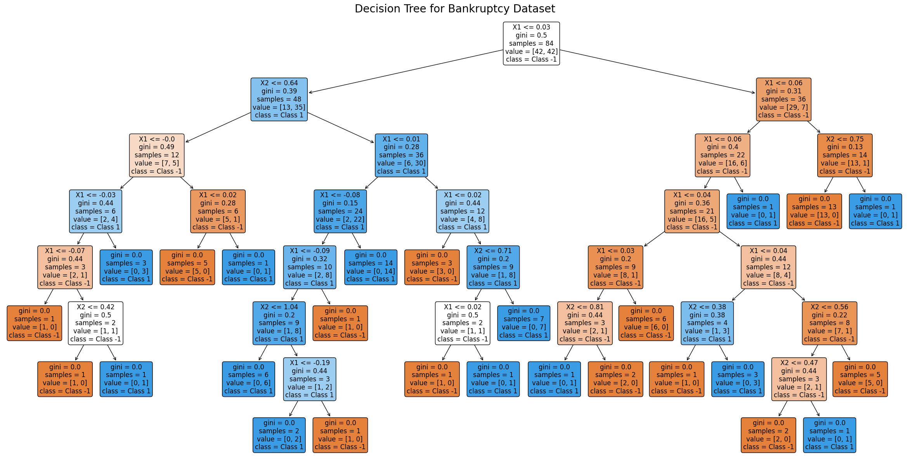

# MVACARTGiniTree1
Performs classification analysis and plots the classification tree for the US bankruptcy data with 84 companies employing the Gini rule.
```python

import pandas as pd
from sklearn.tree import DecisionTreeClassifier, plot_tree
import matplotlib.pyplot as plt

# Load data
data = pd.read_csv('bankruptcy.dat', sep='\s+', header=None)
data.columns = ['X1', 'X2', 'y']

# Prepare the data for the model
X = data[['X1', 'X2']]
y = data['y']

# Create classification tree
clf = DecisionTreeClassifier(
    criterion='gini',           # Splitting criterion
    min_samples_split=2,        # Minimum number of samples required to split a node
    min_samples_leaf=1,         # Minimum number of samples required to be at a leaf node
    max_depth=30,               # Maximum depth of the tree
    random_state=0,             # Ensures reproducibility of the model
)

clf.fit(X, y)

# Plotting
plt.figure(figsize=(30, 15))
plot_tree(
    clf,
    filled=True,
    feature_names=['X1', 'X2'],
    class_names=['Class -1', 'Class 1'],
    rounded=True,
    fontsize=12,
    precision=2
)
plt.title('Decision Tree for Bankruptcy Dataset', fontsize=20)
plt.show()

```
