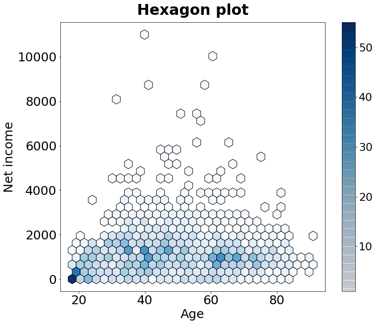

# MVAageIncome
Produces a hexagon and a scatter plot between Age and Net income.

```python
#works on pandas 1.5.2, numpy 1.23.5 and matplotlib 3.6.2
import pandas as pd
import matplotlib.pyplot as plt
import numpy as np

# Load data
allbus = pd.read_csv("allbus.csv", sep=";")
allbus1 = allbus.iloc[:, 1:3]

# Exclude invalid observations
allbus1 = allbus1[(allbus1['ALTER'] <= 100) & (allbus1['NETTOEIN'] < 99997)]

# Get ages and net income
ages = allbus1.iloc[:, 0]
netincome = allbus1.iloc[:, 1]

# Create scatter plot
fig1 ,ax1 = plt.subplots(figsize=(12, 10))
ax1.scatter(ages, netincome)
ax1.set_title("Scatter plot", fontweight = 'bold', fontsize = 30, pad = 15)
ax1.set_xlabel("Age", fontsize = 25)
ax1.set_ylabel("Net income", fontsize = 25)
ax1.set_xticks(np.arange(10,91,10))
ax1.tick_params(axis='both', labelsize=25)

plt.show()

# Create hexbin plot
fig2, ax2 = plt.subplots(figsize=(12,10))
hb = ax2.hexbin(ages, netincome, gridsize=30, cmap='Blues',
                edgecolors = 'black', mincnt = 1)
ax2.set_title("Hexagon plot", fontweight = 'bold', fontsize = 30, pad = 15)
ax2.set_xlabel("Age", fontsize = 25)
ax2.set_ylabel("Net income", fontsize = 25)
ax2.tick_params(axis='both', labelsize=25)
cbar = fig2.colorbar(hb, drawedges = True) 
cbar.ax.tick_params(labelsize=22)

plt.show()


```


