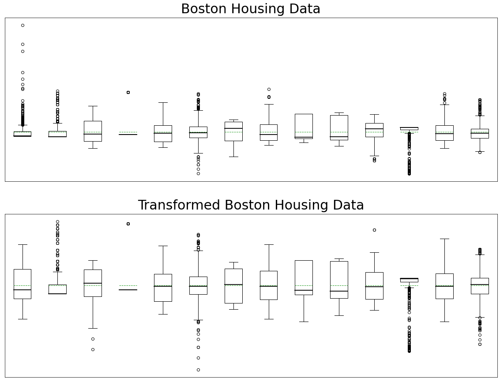

# MVAboxbhd
Computes boxplots for the 14 variables of Boston Housing data.

```python
#works on pandas 1.5.2, numpy 1.23.5 and matplotlib 3.6.2
import pandas as pd
import numpy as np
import matplotlib.pyplot as plt

df = pd.read_csv('bostonh.dat', sep='\s+', header=None, names=np.arange(1,15,1))

df2 = pd.DataFrame()
df2[[1,3,5,6,8,9,10,14]] = np.log(df[[1,3,5,6,8,9,10,14]])
df2[4] = df[4]
df2.loc[:,2] = df.loc[:,2]/10
df2.loc[:,7] = (pow(df.loc[:,7],2.5))/10000
df2.loc[:,11] = (np.exp(0.4*df.loc[:,11]))/1000
df2.loc[:,12] = df.loc[:,12]/100
df2.loc[:,13] = pow(df.loc[:,13],0.5)

cols= np.arange(1,15,1)
df2 = df2[cols]
df = (df-df.mean())/df.std()
df2 = (df2-df2.mean())/df2.std()

fig, axs = plt.subplots(2,1, figsize=(20,15))

axs[0].boxplot(df, medianprops = dict(color="black",linewidth=1.8), showmeans = True, meanline = True)
axs[0].set_xticks([])
axs[0].set_yticks([])
axs[0].set_title("Boston Housing Data", fontsize = 30, pad = 10)

axs[1].boxplot(df2, medianprops = dict(color="black",linewidth=1.8), showmeans = True, meanline = True)
axs[1].set_xticks([])
axs[1].set_yticks([])
axs[1].set_title("Transformed Boston Housing Data", fontsize = 30, pad = 10)

plt.show()

```
