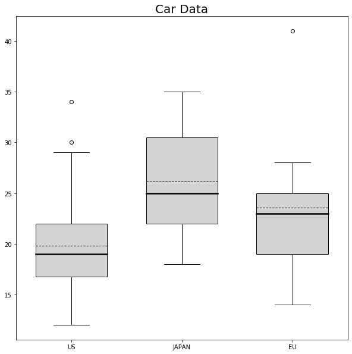

# MVAboxcar
Computes the five-number summary and boxplots for the mileage (X14 variable) of US, Japanese and European cars.

```python
# works on pandas 1.5.2, numpy 1.24.1 and matplotlib 3.6.3
import pandas as pd
import numpy as np
import matplotlib.pyplot as plt

x = pd.read_csv('carc.txt', sep="\t", header=None)

# parameter settings
k = 0
l = 0
m = 0
M = x[1]
C = x[12]

us = x[x[12] == 1][1]
japan = x[x[12] == 2][1]
europe = x[x[12] == 3][1]

m1 = us.mean()
m2 = japan.mean()
m3 = europe.mean()

fig, ax = plt.subplots(figsize = (10, 10))
ax.boxplot([us, japan, europe], labels = ["US", "JAPAN", "EU"], 
           meanline = True, showmeans = True, patch_artist=True, 
           boxprops=dict(facecolor = "lightgrey"), widths = 0.65, 
           medianprops=dict(color="black", linewidth = 2.5), 
           meanprops=dict(color="black"))
plt.title("Car Data", fontsize = 20)
plt.show()

pd.DataFrame(data = {"value": np.quantile(x[1], [0.025, 0.25, 0.5, 0.75, 0.975])}, 
             index = ["2.5%", "25%", "50%", "75%", "97.5%"]).T
```
