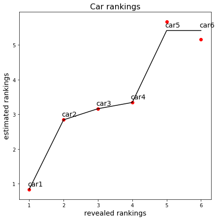

# MVAcarrankings
Performs a monotone transformation to the estimated stimulus utilities of the car example by applying the pool-adjacent-violators (PAV) algorithm.

```python
# works on scikit-learn 1.2.0 and matplotlib 3.6.2
from sklearn.isotonic import IsotonicRegression
import matplotlib.pyplot as plt

# the reported preference orderings
x = list(range(1, 7))
# the estimated preference orderings according to the additive model (16.1) and 
# the metric solution (Table 16.6) in MVA
y = [0.84, 2.84, 3.16, 3.34, 5.66, 5.16]

gp = IsotonicRegression()
y_gp = gp.fit_transform(x, y)

fig, ax = plt.subplots(figsize = (7, 7))
ax.plot(x, y_gp, c = "k")
ax.scatter(x, y, c = "r")
for i in range(0, len(y)):
    ax.text(x[i]-0.05, y_gp[i]+0.1, "car" + str(i+1), fontsize = 14)
plt.xlabel("revealed rankings", fontsize = 14)
plt.ylabel("estimated rankings", fontsize = 14)
plt.title("Car rankings", fontsize = 16)
plt.show()
```
