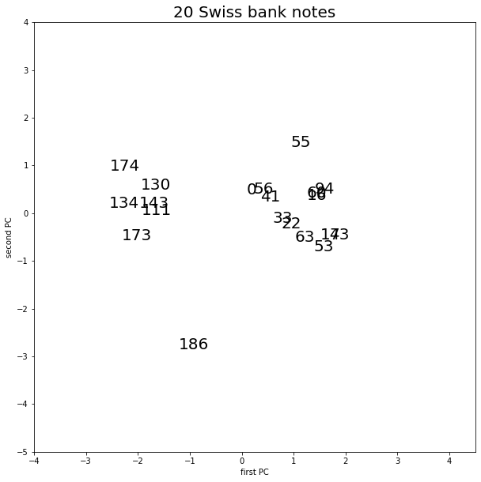

# MVAclusbank
Performs a PCA and a cluster analysis for 20 randomly chosen bank notes from the swiss bank notes dataset.

```python
# works on numpy 1.23.5, pandas 1.5.2, scipy 1.9.3 and matplotlib 3.6.2
import pandas as pd
import numpy as np
import matplotlib.pyplot as plt
from matplotlib.patches import Ellipse
from scipy import cluster


data = pd.read_csv("bank2.dat", sep = "\s+", header=None)

xx = data.sample(n = 20, random_state = 11, replace=False)

mean = np.mean(xx)
m = np.array([mean]*len(xx))
x = xx - m
eva = np.linalg.eig(np.cov(x.T))[0]
eve = np.linalg.eig(np.cov(x.T))[1]
y = x @ eve
ym = y.iloc[:, 0:2]


fig, ax = plt.subplots(figsize = (10, 10))
ax.scatter(ym[0], ym[1], c = "w")
for i in range(0, len(ym)):
    ax.text(ym.iloc[i,0]-0.1, ym.iloc[i,1]-0.07, xx.index[i], fontsize = 20)
ax.set_xlabel("first PC")
ax.set_ylabel("second PC")
ax.set_ylim(-5, 4)
ax.set_xlim(-4, 4.5)
ax.set_title("20 Swiss bank notes", fontsize = 20)

plt.show()

d = np.zeros([len(xx),len(xx)])

for i in range(0, len(xx)):
    for j in range(0, len(xx)):
        d[i, j] = np.linalg.norm(xx.iloc[i, :] - xx.iloc[j, :])

dd = (d**2)

ddd  = dd[1:, :-1][:, 0]
for i in range(1, len(xx)-1):
    ddd = np.concatenate((ddd, dd[1:, :-1][i:, i]))
    
w = cluster.hierarchy.linkage(ddd, 'ward')


fig, ax = plt.subplots(figsize = (10, 10))
h = cluster.hierarchy.dendrogram(w, labels=xx.index)
plt.title("Dendrogram for 20 Swiss bank notes", fontsize = 16)
plt.ylabel("Squared Euclidean Distance")
plt.xlabel("Ward algorithm")

plt.show()


groups = cluster.hierarchy.cut_tree(w, height=20)

merg = np.concatenate((ym, groups), axis = 1)

merg = pd.DataFrame(merg).sort_values(by = 2)

merg1 = merg.iloc[:len(merg[merg.iloc[:, 2] == 0]), :2]
merg2 = merg.iloc[len(merg[merg.iloc[:, 2] == 0]):, :2]

covm = np.cov(merg1.iloc[:, 0], merg1.iloc[:, 1])
covm1 = np.cov(merg2.iloc[:, 0], merg2.iloc[:, 1])

eigva = np.sqrt(np.linalg.eig(covm)[0])
eigve = np.linalg.eig(covm)[1]
eigva1 = np.sqrt(np.linalg.eig(covm1)[0])
eigve1 = np.linalg.eig(covm1)[1]


fig, ax = plt.subplots(figsize = (10, 10))
ax.scatter(ym[0], ym[1], c = "w")
for i in range(0, len(ym)):
    ax.text(ym.iloc[i,0]-0.1, ym.iloc[i,1]-0.07, xx.index[i], fontsize = 20)

ax.add_patch(Ellipse(xy = (np.mean(merg1.iloc[:, 0]), np.mean(merg1.iloc[:, 1])),
                     width = eigva[0]*3*2, height = eigva[1]*3*2,
                     angle = -np.rad2deg(np.arccos(eigve[0, 0])), facecolor = "w", edgecolor = "r", zorder = 0))

ax.add_patch(Ellipse(xy = (np.mean(merg2.iloc[:, 0]), np.mean(merg2.iloc[:, 1])),
                     width = eigva1[0]*3*2, height = eigva1[1]*3*2,
                     angle = -np.rad2deg(np.arccos(eigve1[0, 0])), facecolor = "w", edgecolor = "b", zorder = 0))

ax.scatter(merg1.iloc[:, 0], merg1.iloc[:, 1], c = "r")
ax.scatter(merg2.iloc[:, 0], merg2.iloc[:, 1], c = "b")

ax.set_xlabel("first PC")
ax.set_ylabel("second PC")
ax.set_ylim(-5, 4)
ax.set_xlim(-4, 4.5)
ax.set_title("20 Swiss bank notes, cut height 20", fontsize = 20)

plt.show()
```


