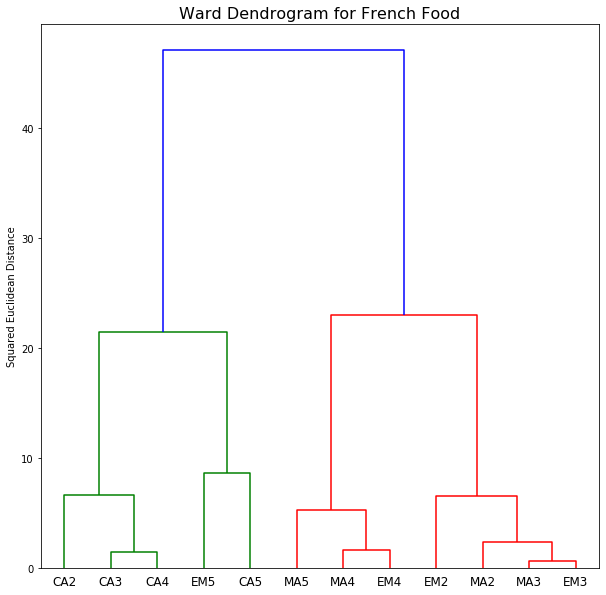

# MVAclusfood
Performs cluster analysis for the french food data after standardization of the variables.

```python
# works on numpy 1.23.5, pandas 1.5.2, scipy 1.9.3 and matplotlib 3.6.2
import pandas as pd
import numpy as np
import matplotlib.pyplot as plt
from matplotlib.patches import Ellipse
from scipy import cluster

fooddat = pd.read_csv("food.dat", sep = "\s+", header=None, index_col = 0)
f = (fooddat - fooddat.mean())/fooddat.std()

mean = f.mean()
m = np.tile(mean, (len(f), 1))
x = f - m

eva = np.linalg.eig(np.cov(x.T))[0]
eve = np.linalg.eig(np.cov(x.T))[1]

y = x @ eve
ym = y.iloc[:, :2]

# Plot 1: PCA

fig, ax = plt.subplots(figsize = (10, 10))
ax.scatter(-ym[0], ym[1], c = "w")
for i in range(0, len(ym)):
    ax.text(-ym.iloc[i,0], ym.iloc[i,1], x.index[i], fontsize = 20)
ax.set_xlabel("first PC")
ax.set_ylabel("second PC")
ax.set_ylim(-4, 4)
ax.set_xlim(-5, 4.5)
ax.set_title("French Food Data", fontsize = 20)
plt.show()


d = np.zeros([len(f),len(f)])

for i in range(0, len(f)):
    for j in range(0, len(f)):
        d[i, j] = np.linalg.norm(f.iloc[i, :] - f.iloc[j, :])

dd = (d**2)

ddd  = dd[1:, :-1][:, 0]
for i in range(1, len(f)-1):
    ddd = np.concatenate((ddd, dd[1:, :-1][i:, i]))
    
w = cluster.hierarchy.linkage(ddd, 'ward')

# Plot 2: Dendrogram for the standardized food.dat after Ward algorithm

fig, ax = plt.subplots(figsize = (10, 10))
h = cluster.hierarchy.dendrogram(w, labels=x.index)
plt.title("Ward Dendrogram for French Food", fontsize = 16)
plt.ylabel("Squared Euclidean Distance")

plt.show()

groups = cluster.hierarchy.cut_tree(w, height=40)

merg = np.concatenate((ym, groups), axis = 1)

merg = pd.DataFrame(merg).sort_values(by = 2)

merg1 = merg.iloc[:len(merg[merg.iloc[:, 2] == 0]), :2]
merg2 = merg.iloc[len(merg[merg.iloc[:, 2] == 0]):, :2]

covm = np.cov(merg1.iloc[:, 0], merg1.iloc[:, 1])
covm1 = np.cov(merg2.iloc[:, 0], merg2.iloc[:, 1])

eigva = np.sqrt(np.linalg.eig(covm)[0])
eigve = np.linalg.eig(covm)[1]
eigva1 = np.sqrt(np.linalg.eig(covm1)[0])
eigve1 = np.linalg.eig(covm1)[1]

fig, ax = plt.subplots(figsize = (10, 10))
ax.scatter(-ym[0], ym[1], c = "w")
for i in range(0, len(ym)):
    ax.text(-ym.iloc[i,0], ym.iloc[i,1], x.index[i], fontsize = 20)

ax.add_patch(Ellipse(xy = (np.mean(-merg1.iloc[:, 0]), np.mean(merg1.iloc[:, 1])),
                     width = eigva[0]*4, height = eigva[1]*4,
                     angle = -np.rad2deg(np.arccos(eigve[0, 0])), 
                     edgecolor = "r", zorder = 0, fill = False))

ax.add_patch(Ellipse(xy = (np.mean(-merg2.iloc[:, 0]), np.mean(merg2.iloc[:, 1])),
                     width = eigva1[0]*4, height = eigva1[1]*4,
                     angle = -np.rad2deg(np.arccos(eigve1[0, 0])), 
                     edgecolor = "b", zorder = 0, fill = False))

ax.scatter(-merg1.iloc[:, 0], merg1.iloc[:, 1], c = "r")
ax.scatter(-merg2.iloc[:, 0], merg2.iloc[:, 1], c = "b")

ax.set_xlabel("first PC")
ax.set_ylabel("second PC")
ax.set_ylim(-4, 4)
ax.set_xlim(-5, 4.5)
ax.set_title("French Food data, cut height 40", fontsize = 20)

plt.show()
```


