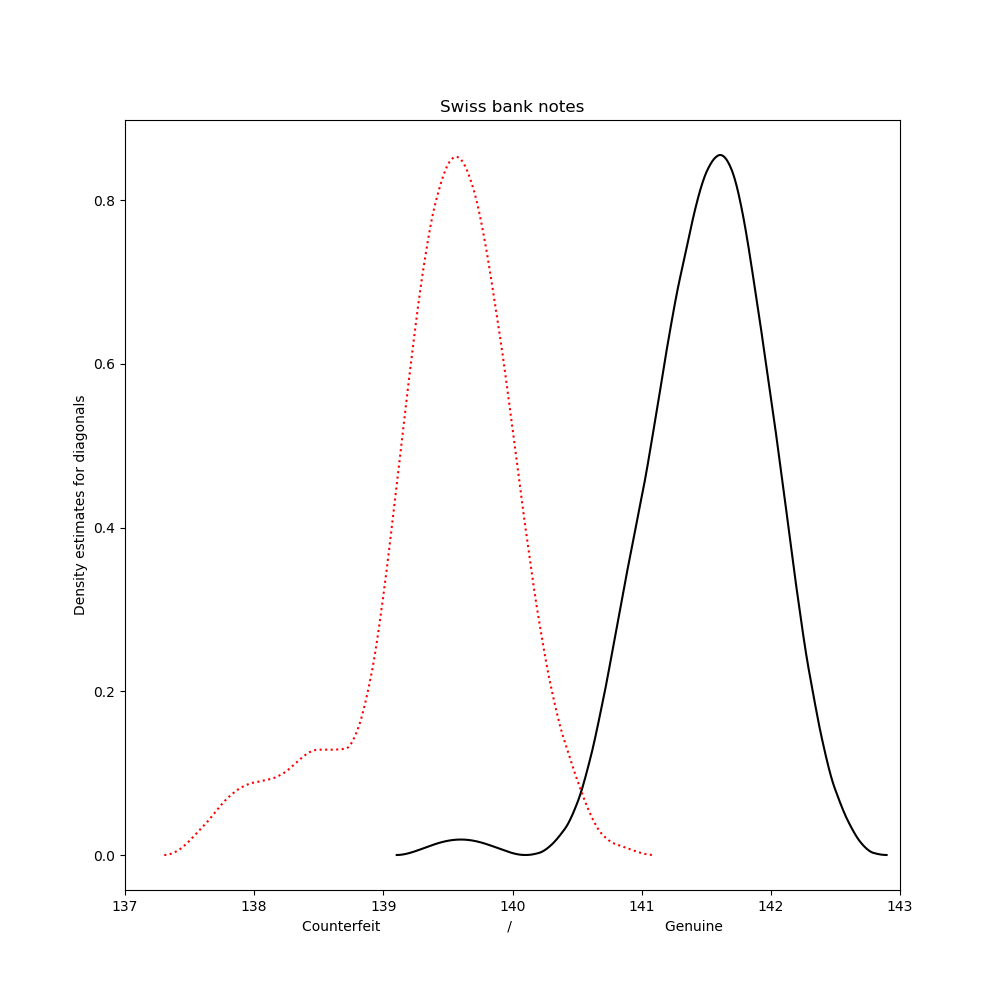

# MVAdenbank
Computes kernel density estimates of the diagonal of the genuine and forged swiss bank notes. The bandwidth parameter are chosen by Silverman rule of thumb.

```python
# works on numpy 1.23.5, pandas 1.5.2, KDEpy 1.1.0 and matplotlib 3.6.2
import pandas as pd
import numpy as np
import matplotlib.pyplot as plt
from KDEpy import FFTKDE

# load data
x = pd.read_csv("bank2.dat", sep = "\s+", header=None)
x1 = x.iloc[0:100, 5]
x2 = x.iloc[100:200, 5]

# Compute kernel density estimate
fh1_x, fh1_y = FFTKDE(bw="silverman", kernel='biweight').fit(np.array(x1)).evaluate()
fh2_x, fh2_y = FFTKDE(bw="silverman", kernel='biweight').fit(np.array(x2)).evaluate()

fig, ax = plt.subplots(figsize=(10,10))
ax.plot(fh1_x, fh1_y, c="black")
ax.plot(fh2_x, fh2_y, c="red", ls=":")
plt.xlim(137, 143)
plt.xlabel("Counterfeit                             /                                   Genuine")
plt.ylabel("Density estimates for diagonals")
plt.title("Swiss bank notes")

plt.show()
```
