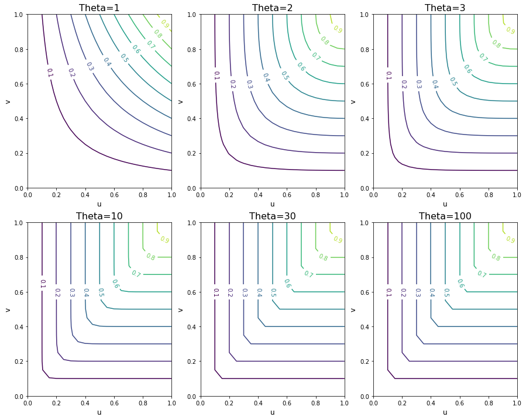

# MVAghcontour
Gives contour plots of Gumbel-Hougard copula for different theta values (1, 2, 3,
10, 30 and 100).

```python
# works on numpy 1.23.5 and matplotlib 3.6.2
import numpy as np
import matplotlib.pyplot as plt

contours = np.arange(0.1,1.01,0.1)
theta = [1,2,3,10,30,100]
N = 21
fig, axs = plt.subplots(2,3, figsize=(15,12))

axs = axs.ravel()

for i,theta in enumerate(theta):

    v = u = np.arange(0, 1.01, 0.05)
    uu = np.tile(u,N)
    vv = np.repeat(v,N)
    w = np.exp(-((-np.log(uu))**theta + (-np.log(vv))**theta)**(1/theta))
    ww = w.reshape(N,N)
    xx,yy = np.meshgrid(u,v)
    
    CS = axs[i].contour(xx,yy,ww, contours)
    axs[i].set_title("Theta=%d" % theta, fontsize = 16)
    axs[i].set_xlabel("u", fontsize = 12)
    axs[i].set_ylabel("v", fontsize = 12)
    axs[i].clabel(CS, contours)

plt.show()
```
