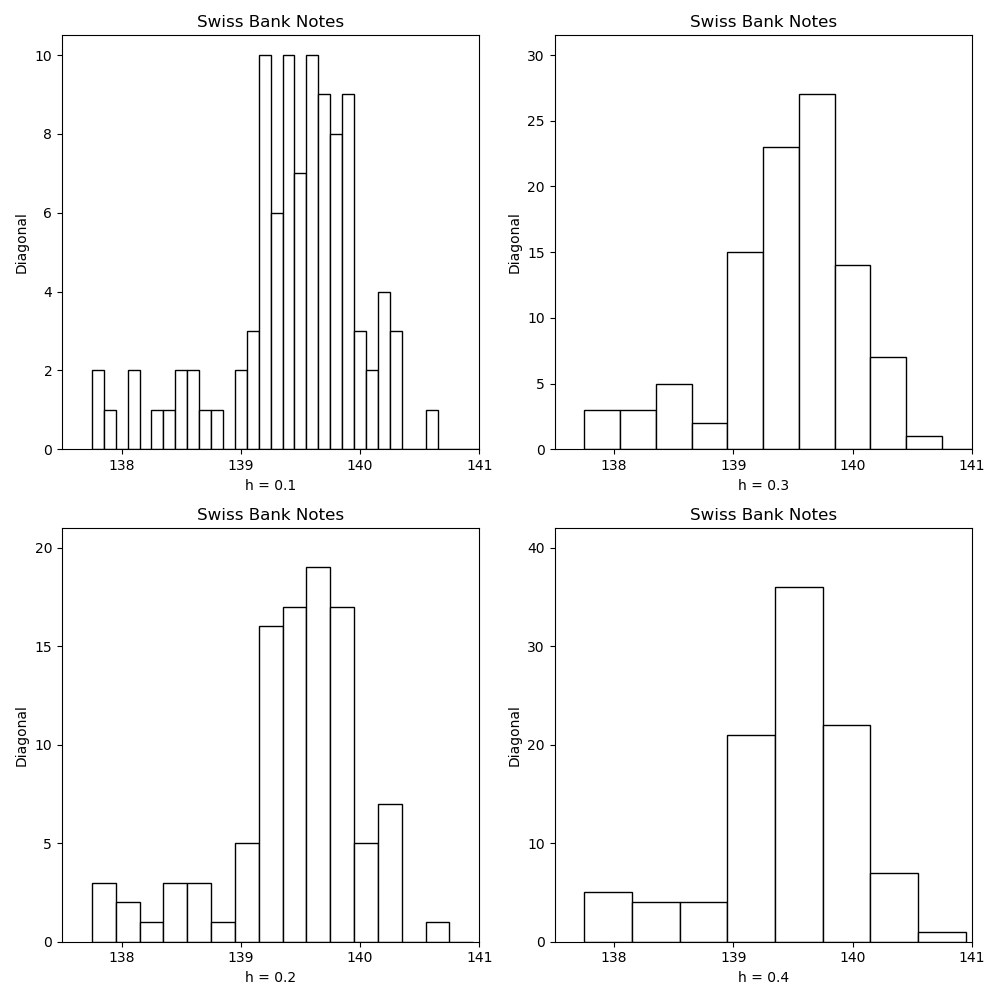

# MVAhisbank1
Computes 4 histograms for the diagonal of the forged Swiss bank notes. The histograms are different with respect to their binwidth.

```python
# works on numpy 1.23.5, pandas 1.5.2 and matplotlib 3.6.2
import pandas as pd
import numpy as np
import matplotlib.pyplot as plt

# load data
x = pd.read_csv("bank2.dat", sep = "\s+", header=None)
x = x.iloc[100:200, 5]
origin = 137.75

# Because origin<min(x), the histogram includes all values
y1 = np.arange(137.75, 141.05, 0.1)
y2 = np.arange(137.75, 141.05, 0.2)
y3 = np.arange(137.75, 141.05, 0.3)
y4 = np.arange(137.75, 141.05, 0.4)

fig, axes = plt.subplots(2, 2, figsize = (10,10))
axes[0,0].hist(x, y1, edgecolor = "black", color = "white")
axes[0,0].set_xlabel("h = 0.1")
axes[0,0].set_ylabel("Diagonal")
axes[0,0].set_title("Swiss Bank Notes")
axes[0,0].set_xlim(137.5, 141)
axes[0,0].set_xticks(list(range(138, 142)))
axes[0,0].set_ylim(0, 10.5)
axes[0,0].set_yticks(list(range(0, 11, 2)))

axes[0,1].hist(x, y3, edgecolor = "black", color = "white")
axes[0,1].set_xlabel("h = 0.3")
axes[0,1].set_ylabel("Diagonal")
axes[0,1].set_title("Swiss Bank Notes")
axes[0,1].set_xlim(137.5, 141)
axes[0,1].set_xticks(list(range(138, 142)))
axes[0,1].set_ylim(0, 31.5)
axes[0,1].set_yticks(list(range(0, 31, 5)))

axes[1,0].hist(x, y2, edgecolor = "black", color = "white")
axes[1,0].set_xlabel("h = 0.2")
axes[1,0].set_ylabel("Diagonal")
axes[1,0].set_title("Swiss Bank Notes")
axes[1,0].set_xlim(137.5, 141)
axes[1,0].set_xticks(list(range(138, 142)))
axes[1,0].set_ylim(0, 21)
axes[1,0].set_yticks(list(range(0, 21, 5)))

axes[1,1].hist(x, y4, edgecolor = "black", color = "white")
axes[1,1].set_xlabel("h = 0.4")
axes[1,1].set_ylabel("Diagonal")
axes[1,1].set_title("Swiss Bank Notes")
axes[1,1].set_xlim(137.5, 141)
axes[1,1].set_xticks(list(range(138, 142)))
axes[1,1].set_ylim(0, 42)
axes[1,1].set_yticks(list(range(0, 41, 10)))

fig.tight_layout()

plt.show()
```
