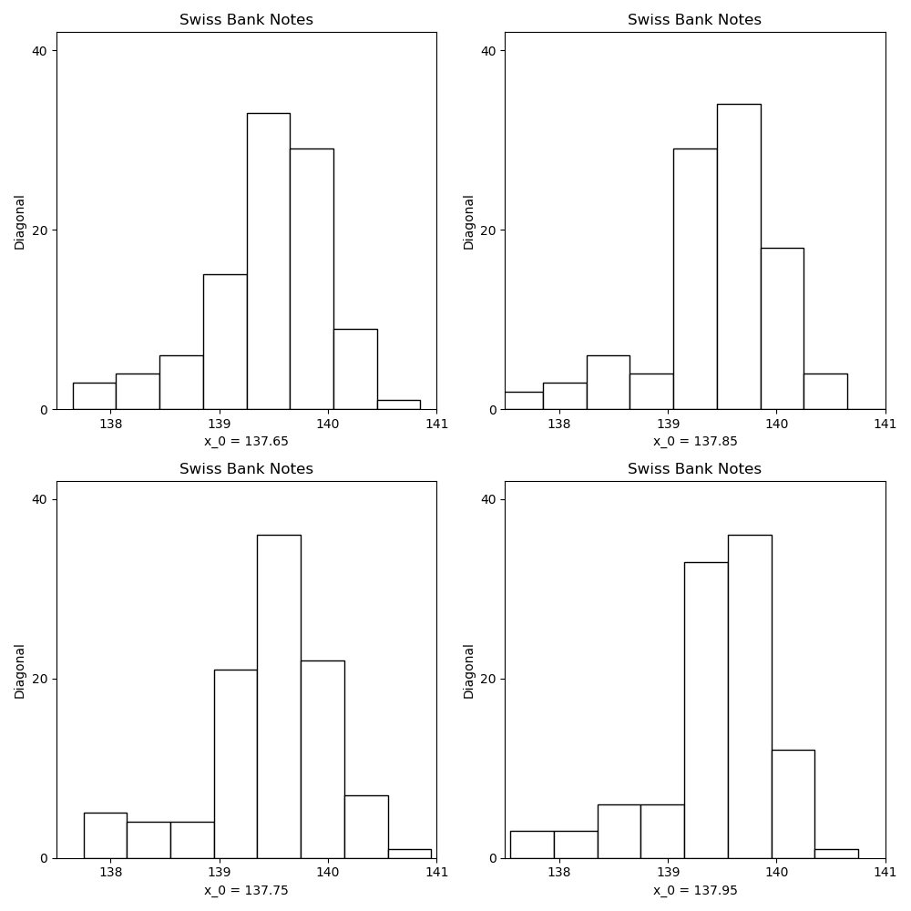

# MVAhisbank2
Computes 4 histograms for the diagonal of the forged Swiss bank notes. The histograms are different with respect to their origin.

```python
import pandas as pd
import numpy as np
import matplotlib.pyplot as plt

# load data
x = pd.read_csv("bank2.dat", sep = "\s+", header=None)
x = x.iloc[100:200, 5]

origin1 = 137.65
origin2 = 137.75
origin3 = 137.85
origin4 = 137.95

y1 = np.arange(origin1, 141.05, 0.4)
y2 = np.arange(origin2, 141.05, 0.4)
y3 = np.arange(origin3 - 0.4, 141.05, 0.4)  # origin>min(x)
y4 = np.arange(origin4 - 0.4, 141.05, 0.4)  # origin>min(x)

fig, axes = plt.subplots(2, 2, figsize = (10,10))
axes[0,0].hist(x, y1, edgecolor = "black", color = "white")
axes[0,0].set_xlabel("x_0 = " + str(origin1))
axes[0,0].set_ylabel("Diagonal")
axes[0,0].set_title("Swiss Bank Notes")
axes[0,0].set_xlim(137.5, 141)
axes[0,0].set_xticks(list(range(138, 142)))
axes[0,0].set_ylim(0, 42)
axes[0,0].set_yticks(list(range(0, 41, 20)))

axes[0,1].hist(x, y3, edgecolor = "black", color = "white")
axes[0,1].set_xlabel("x_0 = " + str(origin3))
axes[0,1].set_ylabel("Diagonal")
axes[0,1].set_title("Swiss Bank Notes")
axes[0,1].set_xlim(137.5, 141)
axes[0,1].set_xticks(list(range(138, 142)))
axes[0,1].set_ylim(0, 42)
axes[0,1].set_yticks(list(range(0, 41, 20)))

axes[1,0].hist(x, y2, edgecolor = "black", color = "white")
axes[1,0].set_xlabel("x_0 = " + str(origin2))
axes[1,0].set_ylabel("Diagonal")
axes[1,0].set_title("Swiss Bank Notes")
axes[1,0].set_xlim(137.5, 141)
axes[1,0].set_xticks(list(range(138, 142)))
axes[1,0].set_ylim(0, 42)
axes[1,0].set_yticks(list(range(0, 41, 20)))

axes[1,1].hist(x, y4, edgecolor = "black", color = "white")
axes[1,1].set_xlabel("x_0 = " + str(origin4))
axes[1,1].set_ylabel("Diagonal")
axes[1,1].set_title("Swiss Bank Notes")
axes[1,1].set_xlim(137.5, 141)
axes[1,1].set_xticks(list(range(138, 142)))
axes[1,1].set_ylim(0, 42)
axes[1,1].set_yticks(list(range(0, 41, 20)))

fig.tight_layout()
plt.show()
```
