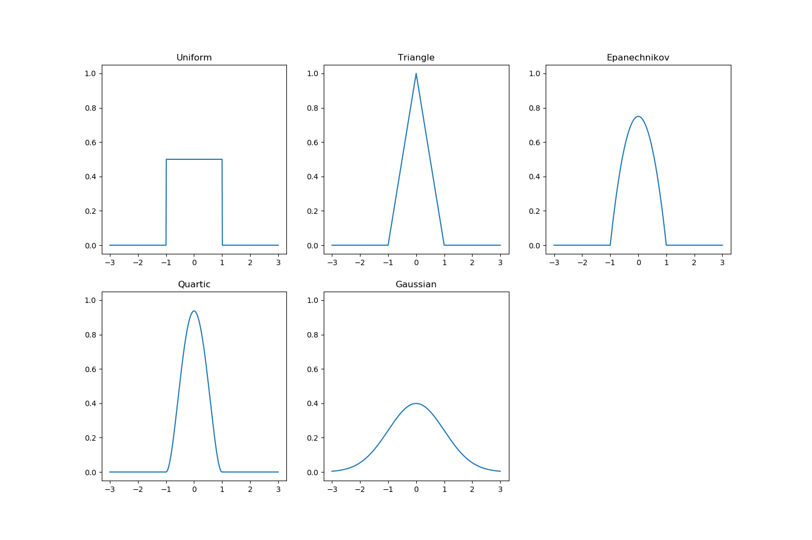

# MVAkernelfunctions
Plots different kernel functions: Uniform, Triangle, Epanechnikov, Quartic (biweight), Gaussian.

```python
# works on numpy 1.23.5, pandas 1.5.2 and matplotlib 3.6.2
import pandas as pd
import numpy as np
import matplotlib.pyplot as plt

# Different Kernel Functions
u = np.arange(-3, 3.01, 0.01)

K_Uniform = 0.5 * (abs(u) <= 1) # kernel of uniform distribution
K_Triangle = (1 - abs(u)) * (abs(u) <= 1) # kernel of triangle distribution
K_Epanechnikov = 0.75 * (1 - u**2) * (abs(u) <= 1) # epanechnikov kernel
K_Quartic = 0.9375 * (1 - u**2)**2 * (abs(u) <= 1) # kernel of quadratic biweighted distribution
K_Gaussian = 0.3989 * np.exp(-0.5 * u**2) # kernel of a gaussian distribution

kernels = ["K_Uniform", "K_Triangle", "K_Epanechnikov", "K_Quartic", "K_Gaussian"]


# Plot Kernels
fig, axes = plt.subplots(2, 3, figsize = (15, 10))
kernels = ["K_Uniform", "K_Triangle", "K_Epanechnikov", "K_Quartic", "K_Gaussian"]
k = 0
for c in range(0, 3):
    axes[0,c].plot(u, eval(kernels[k]))
    axes[0,c].set_ylim(-0.05,1.05)
    axes[0,c].set_title(kernels[k][2:])
    k += 1
    
for c in range(0, 2):
    axes[1,c].plot(u, eval(kernels[k]))
    axes[1,c].set_ylim(-0.05,1.05)
    axes[1,c].set_title(kernels[k][2:])
    k += 1


fig.delaxes(axes[1,2])
plt.show()
```
