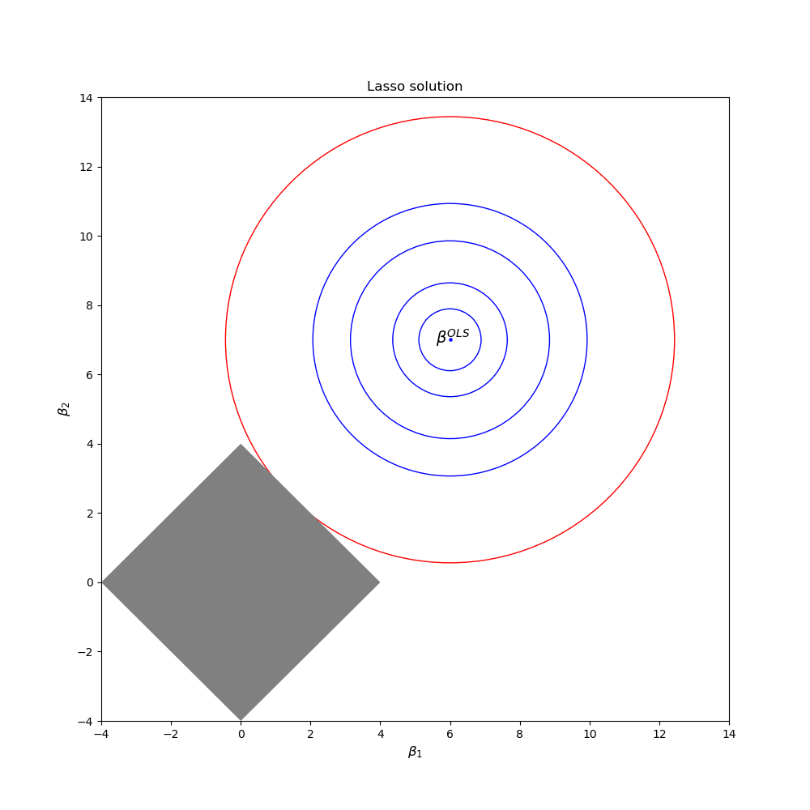

# MVAlassocontour
Plots the Lasso solution under the least squares loss function. The contour plots of the quadratic form objective function are produced which are centered at the least squares solution (beta_1,beta_2)^t = (6,7)^t in the two-dimensional case for the case of both the non-orthonormal and orthonormal design. The tuning parameter s being equal to 4.

```python
import pandas as pd
import numpy as np
from scipy.stats import chi2
import matplotlib.pyplot as plt
from matplotlib.patches import Ellipse
from matplotlib.patches import Rectangle

orthonorm = 0
s = 4
beta = [6, 7]

if orthonorm == 1:
    corrmat = np.array([[1, 0], [0, 1]])
    ellip1 = Ellipse(xy = [beta[0], beta[1]], 
                     width = np.sqrt(1 + corrmat[0,1])*2*chi2.ppf(0.96, 2), 
                     height = np.sqrt(1 - corrmat[0,1])*2*chi2.ppf(0.96, 2), 
                     facecolor = "w", edgecolor = "r", zorder = 0)
elif orthonorm == 0:
    corrmat = np.array([[1, 0.5], [0.5, 1]])
    ellip1 = Ellipse(xy = [beta[0], beta[1]], 
                     width = np.sqrt(1 + corrmat[0,1])*1.62*chi2.ppf(0.96, 2), 
                     height = np.sqrt(1 - corrmat[0,1])*1.62*chi2.ppf(0.96, 2), 
                     angle = 45,
                     facecolor = "w", edgecolor = "r", zorder = 0)
else:
    print("Give either 1 or 0")
    
conflev = [0.86, 0.76, 0.56, 0.36]

fig, ax = plt.subplots(figsize = (10,10))
ax.add_patch(ellip1)
ax.add_patch(Rectangle(xy = (0, -s), width = s*np.sqrt(2), height = s*np.sqrt(2), angle=45, facecolor = "grey"))

if orthonorm == 1:
    for i in conflev:
        ax.add_patch(Ellipse(xy = [beta[0], beta[1]], width = np.sqrt(1 + corrmat[0,1])*2*chi2.ppf(i, 2), 
                             height = np.sqrt(1 - corrmat[0,1])*2*chi2.ppf(i, 2), 
                             facecolor = "w", edgecolor = "b", angle = 45, zorder = 0))
elif orthonorm == 0:
    for i in conflev:
        ax.add_patch(Ellipse(xy = [beta[0], beta[1]], width = np.sqrt(1 + corrmat[0,1])*1.62*chi2.ppf(i, 2), 
                             height = np.sqrt(1 - corrmat[0,1])*1.62*chi2.ppf(i, 2), 
                             facecolor = "w", edgecolor = "b", angle = 45, zorder = 0))
        
ax.scatter(6, 7, c = "b", s = 5)
ax.text(5.6, 6.9, r"$\beta^{OLS}$", fontsize = 14)

ax.set_xlim(-4, 14)
ax.set_ylim(-4, 14)

ax.set_title("Lasso solution")
ax.set_xlabel(r"$\beta_1$", fontsize = 12)
ax.set_ylabel(r"$\beta_2$", fontsize = 12)

plt.show()
```

