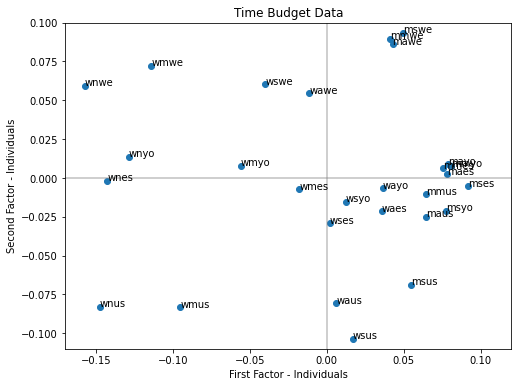
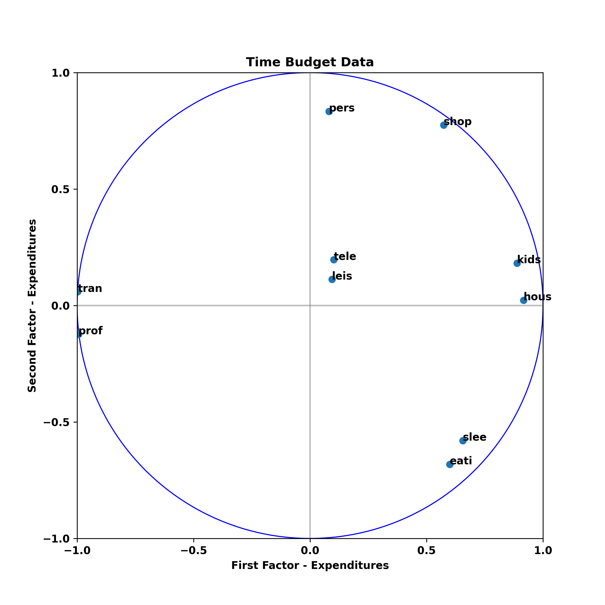

# MVAnpcatime
Performs a PCA for the Standardized time budget data and shows the first two
principal components for the individuals and the variables.

```python
#works on numpy 1.25.2, pandas 2.1.1 and matplotlib 3.8.0
import pandas as pd
import numpy as np
import matplotlib.pyplot as plt
from matplotlib.patches import Circle

x = pd.read_csv('timebudget.dat', sep="\s+", header = None)

n, p = x.shape
x = (x-x.mean())/(np.sqrt((n-1) * np.var(x, axis=0)))
e, v = np.linalg.eig(np.dot(x, x.T/n))
w = v[:,0:2] * np.sqrt(e[0:2])

labels = ["maus", "waus", "wnus", "mmus", "wmus", "msus", "wsus", "mawe", "wawe", 
    "wnwe", "mmwe", "wmwe", "mswe", "wswe", "mayo", "wayo", "wnyo", "mmyo", "wmyo", 
    "msyo", "wsyo", "maes", "waes", "wnes", "mmes", "wmes", "mses", "wses"]

fig, ax = plt.subplots(figsize=(8, 6))
ax.plot([0,0],[-0.6,0.6], color='grey', alpha=0.5)
ax.plot([-1,0.6],[0,0], color='grey', alpha=0.5)
ax.set_xlim(-0.17, 0.12)
ax.set_ylim(-0.1, 0.1)
ax.scatter(w[:,0], w[:,1])
[ax.annotate(name, (w[i, 0], w[i, 1])) for i, name in enumerate(labels)]
ax.set_title('Time Budget Data')
ax.set_xlabel('First Factor - Individuals')
ax.set_ylabel('Second Factor - Individuals')
plt.show()

e1, v1 = np.linalg.eig(np.dot(x.T, x))
z = v1[:,0:2] * np.sqrt(e1[0:2])

labels = ["prof", "tran", "hous", "kids", "shop", "pers", "eati", "slee", "tele", 
    "leis"]

fig, ax = plt.subplots(figsize=(8, 8))
ax.plot([0,0],[-1,1], color='grey', alpha=0.5)
ax.plot([-1,1],[0,0], color='grey', alpha=0.5)
ax.set_ylim(-1,1)
ax.set_xlim(-1,1)
circle = Circle((0,0), 1, color='b', fill=False)
ax.add_patch(circle)
ax.set_xticks([-1,-0.5,0,0.5,1])
ax.set_yticks([-1,-0.5,0,0.5,1])
ax.set_aspect('equal')
ax.scatter(z[:,0], z[:,1])
[ax.annotate(name, (z[i, 0], z[i, 1])) for i, name in enumerate(labels)]
ax.set_title('Time Budget Data')
ax.set_xlabel('First Factor - Expenditures')
ax.set_ylabel('Second Factor - Expenditures')
plt.show()
```

