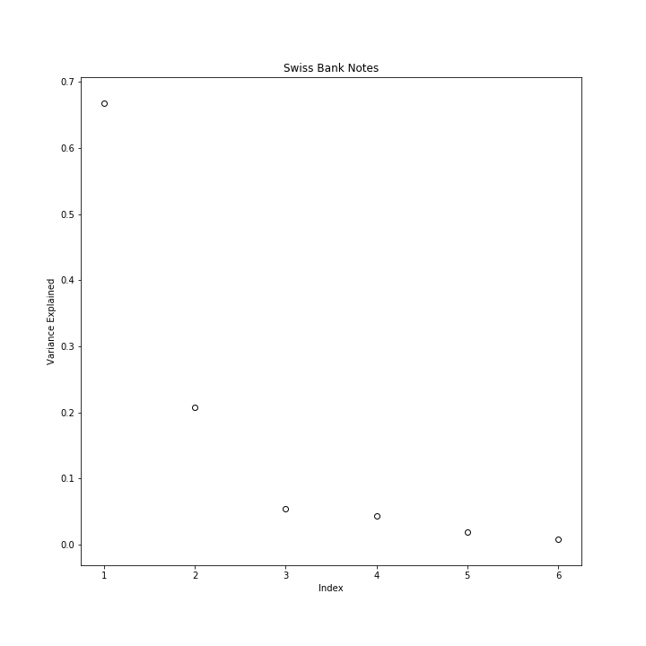
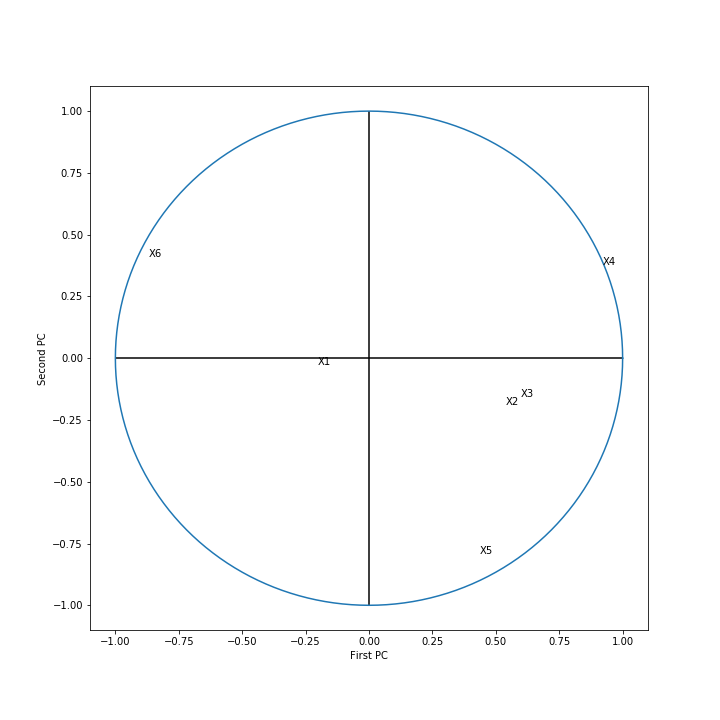

# MVApcabanki
Shows a screeplot of the eigenvalues for the PCA of the Swiss bank notes. It computes the correlations between the variables and the principal components and displays the first two of them.

```python
import pandas as pd
import numpy as np
import matplotlib.pyplot as plt

x = pd.read_csv("bank2.dat", sep = "\s+", header=None)
n = len(x)

e = np.linalg.eig((n - 1) * np.cov(x.T)/n)
e1 = e[0]/sum(e[0])


fig, ax = plt.subplots(figsize = (10, 10))
ax.scatter(range(1, 7), e1, c = "w", edgecolors = "black")
ax.set_xlabel("Index")
ax.set_ylabel("Variance Explained")
ax.set_title("Swiss Bank Notes")

plt.show()


m = np.mean(x)
temp = np.array(x - np.array([m]*n))
r = np.dot(temp, e[1])
r = pd.concat([pd.DataFrame(r), x], axis = 1).corr()
r1 = r.iloc[6:, :2]

ucircle = pd.DataFrame([np.cos(np.array(range(0, 361))/180 * np.pi), np.sin(np.array(range(0, 361))/180 * np.pi)]).T


fig, ax = plt.subplots(figsize = (10, 10))
ax.plot(ucircle[0], ucircle[1])
ax.hlines(0, -1, 1)
ax.vlines(0, -1, 1)
ax.set_xlabel("First PC")
ax.set_ylabel("Second PC")
for i in range(0, 6):
    plt.text(r1[0][i], r1[1][i], s = "X" + str(i+1))

plt.show()
```

