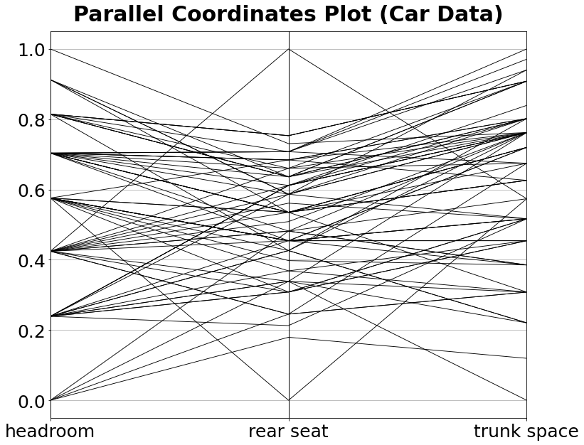

# MVApcp5
Computes parallel coordinates plot for variables headroom, rear seat clearance and trunk space of the car data set.

```python
#works on pandas 1.5.2, numpy 1.23.5 and matplotlib 3.7.0
import pandas as pd
import numpy as np
import matplotlib.pyplot as plt
from pandas.plotting import parallel_coordinates

df = pd.read_table("carc.txt", header=None)
df = df.iloc[:,[4,5,6]]
for i in df.columns:
    df[i] = np.log(df[i])
    df[i] = (df[i]-np.min(df[i])) / np.ptp(df[i])

df.rename(columns={4:"headroom", 5:"rear seat", 6:"trunk space"},
          inplace=True)
df["name"] = "Parallel Coordinates Plot(Car Data)"

fig, ax = plt.subplots(figsize = (12,10))

parallel_coordinates(df, "name", color=("black"), linewidth ="0.9")
plt.legend().set_visible(False)
ax.tick_params(axis='both', labelsize=25)
plt.title(label = "Parallel Coordinates Plot(Car Data)", 
          fontsize = 30, fontweight = "bold", pad = 15)
plt.show()
```

