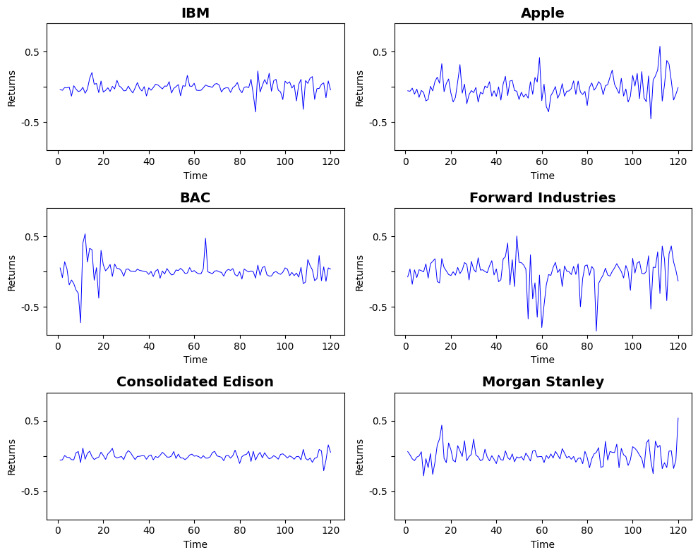

# MVAreturns
Shows monthly returns of six US firms from Jan 2000 to Dec 2009.

```python

import pandas as pd
import matplotlib.pyplot as plt

# Load data
ibm = pd.read_csv("ibm.csv")
apple = pd.read_csv("apple.csv")
bac = pd.read_csv("bac.csv")
ford = pd.read_csv("ford.csv")
ed = pd.read_csv("ed.csv")
ms = pd.read_csv("ms.csv")

# Function to compute returns
def compute_returns(df):
    y = df.iloc[:, 4]
    a = [0]
    for i in range(1, 121):  
        a.append((y[i] - y[i - 1]) / y[i])
    return a[1:]

# Compute returns for each company
x1 = compute_returns(ibm)
x2 = compute_returns(apple)
x3 = compute_returns(bac)
x4 = compute_returns(ford)
x5 = compute_returns(ed)
x6 = compute_returns(ms)

# Prepare time series data
t = list(range(1, 121))
ts_ibm = pd.DataFrame({'Time': t, 'Returns': x1})
ts_apple = pd.DataFrame({'Time': t, 'Returns': x2})
ts_bac = pd.DataFrame({'Time': t, 'Returns': x3})
ts_ford = pd.DataFrame({'Time': t, 'Returns': x4})
ts_ed = pd.DataFrame({'Time': t, 'Returns': x5})
ts_ms = pd.DataFrame({'Time': t, 'Returns': x6})

# Plotting
fig, axes = plt.subplots(nrows=3, ncols=2, figsize=(10, 8))
axes = axes.flatten()

def plot_data(ax, data, title):
    ax.plot(data['Time'], data['Returns'], color='blue', linewidth = .7)
    ax.set_ylim([-0.9, 0.9])
    ax.set_yticks([-0.5, 0, 0.5])
    ax.set_yticklabels(['-0.5', '', '0.5']) 
    ax.set_title(title, fontsize=14, fontweight='bold')
    ax.set_xlabel('Time')
    ax.set_ylabel('Returns')

# Plot returns data
plot_data(axes[0], ts_ibm, 'IBM')
plot_data(axes[1], ts_apple, 'Apple')
plot_data(axes[2], ts_bac, 'BAC')
plot_data(axes[3], ts_ford, 'Forward Industries')
plot_data(axes[4], ts_ed, 'Consolidated Edison')
plot_data(axes[5], ts_ms, 'Morgan Stanley')

plt.tight_layout()
plt.show()

```

