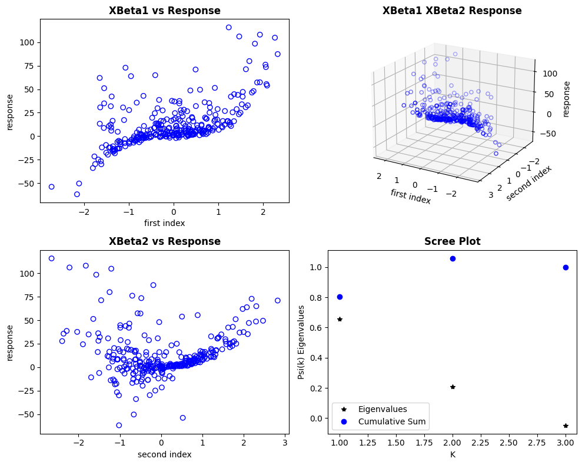

# MVAsir2data
Generates a data set and applies the sliced inverse regression algorithm (SIR II) for dimension reduction.
```python

import numpy as np
from numpy import linalg
import matplotlib.pyplot as plt
from mpl_toolkits.mplot3d import Axes3D

# Author: Russell Kunes https://github.com/russellkune/SIR
# Modified for SIR II and commented by: Kinane Habra
# Package dependence: numpy

class SIR2:
    def __init__(self, K=2, H=10, bins=None):
        # K: Number of EDR directions to estimate
        # H: Number of slices of the response variable Y
        # bins: Custom bin edges; if None, bins are equally spaced
        self.K = K
        self.H = H
        self.bins = bins

    def fit(self, X, Y):
        # Fit the SIR II model to the data
        # X: Predictor variables
        # Y: Response variable

        # Step 1 (identical to SIR I): Standardize X and compute the bins for Y
        n = X.shape[0]
        p = X.shape[1]
        x_bar = np.mean(X, axis=0)  # Sample mean of X

        # Step 2 (identical to SIR I): Compute bins and number of observations per bin
        if self.bins is None:
            n_h, bins = np.histogram(Y, bins=self.H)
        else:
            n_h, bins = np.histogram(Y, bins=self.bins)
        
        # Assign each observation to a slice
        assignments = np.digitize(Y, bins)
        # Ensure last observation is within the last slice
        assignments[np.argmax(assignments)] -= 1

        # V_hat for step 4 and V_s_sum for step 3 of SIR II
        V_s_sum = np.zeros((p, p))
        V_hat = np.zeros((p, p)) 

        # Step 3 (identical to SIR I): Loop through slices and compute within-slice covariance matrix
        for i in range(len(n_h)):
            h = n_h[i]
            slice_mask = assignments == i + 1

            if h != 0:
                X_h = X[slice_mask]
                V_s = np.cov(X_h, rowvar=False)
                V_s_sum += h * V_s  # Accumulate the slice covariances weighted by the slice size

        # Calculate the mean over all slice covariances (step 3 of SIR II)
        V_bar = V_s_sum / n

        # Step 4 of SIR II: Compute the estimate for equation (20.12)
        for i in range(len(n_h)):
            h = n_h[i]
            slice_mask = assignments == i + 1

            if h != 0:
                X_h = X[slice_mask]
                V_s = np.cov(X_h, rowvar=False)
            else:
                V_s = np.zeros((p, p))

            V_hat += h * (V_s - V_bar) ** 2

        V_hat = V_hat / n  # Final computation for the covariance estimate for equation (20.12)

        # Step 5: Eigendecomposition to identify EDR directions
        cov = np.cov(X.T)
        V = np.dot(linalg.inv(cov), V_hat)  # Adjusted covariance matrix
        eigenvalues, eigenvectors = linalg.eig(V)

        # Sort eigenvalues and eigenvectors
        idx = eigenvalues.argsort()[::-1]  
        eigenvalues = eigenvalues[idx]
        eigenvectors = eigenvectors[:, idx]

        # Select the first K eigenvectors as the EDR directions
        beta = eigenvectors[:, 0:self.K]
        self.beta = beta
        self.eigenvalues = eigenvalues

    def transform(self, X_to_predict):
        # Transform new data onto the EDR space using the beta coefficients
        beta = self.beta
        return np.dot(X_to_predict, beta)
    

np.random.seed(2727)
n = 300                                    # number of observations
ns = 20                                    # number of elements in each slice
h = np.floor(n / ns)                       # number of slices
x = np.column_stack((np.random.randn(n),   # n x 3 matrix, the explanatory variable
                     np.random.randn(n),
                     np.random.randn(n)))
e = np.random.randn(n)                     # n vector, the noise variable
b2 = np.array([1, -1, -1])                 # projection vector
b1 = np.array([1, 1, 1])                   # projection vector

y = x@b1 + (x@b1)** 3 + 4 * (x@b2) ** 2 + e  # n vector, the response variable

edr = SIR2(K = 3, H = int(h))
edr.fit(x,y)

f = edr.beta  # matrix of the estimated EDR-directions
g = edr.eigenvalues # vector of eigenvalues

# matrices for the true indices and the true responses
m1 = np.column_stack((x@b1, y))
m2 = np.column_stack((x@b2, y))

# Sort m1 and m2 based on the first column
m1 = m1[m1[:, 0].argsort()]
m2 = m2[m2[:, 0].argsort()]

sg = sum(g)
g2 = g / sg
psi = np.array([g2[0], g2[0] + g2[1], g2[0] + g2[1] + g2[2]])

# Compute projections
p11 = np.column_stack((x @ f[:, 0], y))
p21 = np.column_stack((x @ f[:, 1], y))
p12 = np.column_stack((x @ f[:, 0], x @ f[:, 1], y))

# Plotting
fig = plt.figure(figsize=(10, 8))

# First subplot
ax1 = fig.add_subplot(221)
ax1.scatter(p11[:, 0], p11[:, 1], color="blue", facecolors='none')
ax1.set_xlabel("first index")
ax1.set_ylabel("response")
ax1.set_title("XBeta1 vs Response", fontweight='bold')

# Second subplot
ax2 = fig.add_subplot(222, projection='3d')
ax2.scatter(p12[:, 0], p12[:, 1], p12[:, 2], color="blue", facecolors='none')
ax2.set_xlabel("first index")
ax2.set_ylabel("second index")
ax2.set_zlabel("response")
ax2.set_title("XBeta1 XBeta2 Response", fontweight='bold')
ax2.view_init(elev=20, azim=120)

# Third subplot
ax3 = fig.add_subplot(223)
ax3.scatter(p21[:, 0], p21[:, 1], color="blue", facecolors='none')
ax3.set_xlabel("second index")
ax3.set_ylabel("response")
ax3.set_title("XBeta2 vs Response", fontweight='bold')


# Fourth subplot (Scree plot)
ax4 = fig.add_subplot(224)
i = np.array([1, 2, 3])
ax4.plot(i, g, '*', color='k', label='Eigenvalues')
ax4.plot(i, psi, 'o', color='b', label='Cumulative Sum')
ax4.set_xlabel("K")
ax4.set_ylabel("Psi(k) Eigenvalues")
ax4.set_title("Scree Plot", fontweight='bold')
ax4.legend()


plt.tight_layout()
plt.show()

```
