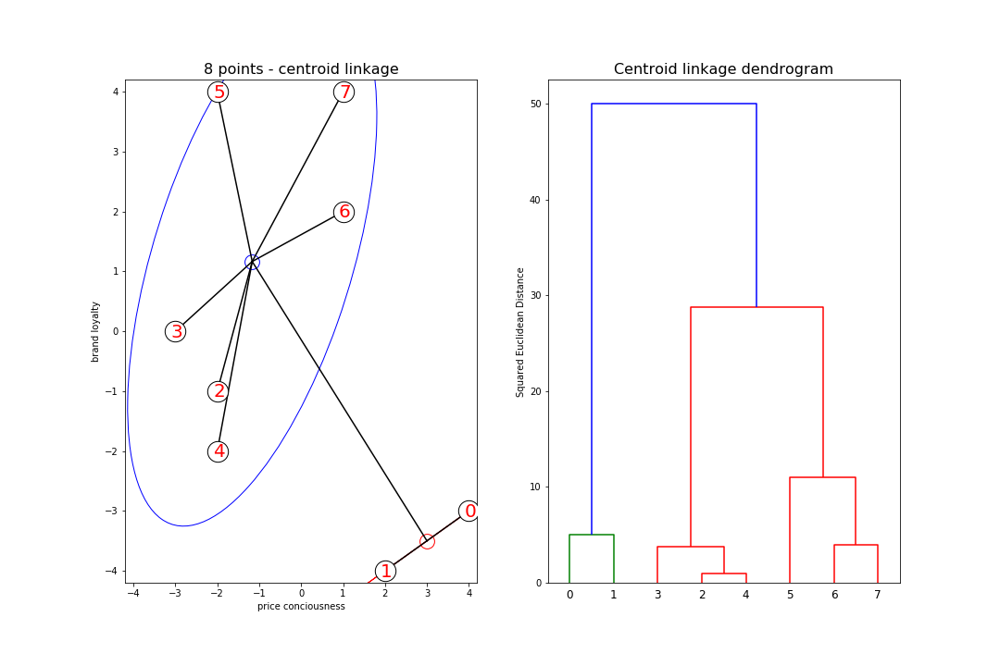

# SMSclus8pc
Employs the centroid linkage using squared Euclidean distance matrices to perform a cluster analysis on an 8 points example.

```python
# works on numpy 1.23.5, pandas 1.5.2, scipy 1.9.3 and matplotlib 3.6.2
import pandas as pd
import numpy as np
import matplotlib.pyplot as plt
from matplotlib.patches import Ellipse
from scipy.cluster import hierarchy


eight = np.array(([-3, -2, -2, -2, 1, 1, 2, 4], [0, 4, -1, -2, 4, 2, -4, -3])).T
eight = eight[[7,6,2,0,3,1,5,4], :]

d = np.zeros([8,8])

for i in range(0, 8):
    for j in range(0, 8):
        d[i, j] = np.linalg.norm(eight[i, :] - eight[j, :])

dd = (d**2)

ddd  = dd[1:, :-1][:, 0]
for i in range(1, 7):
    ddd = np.concatenate((ddd, dd[1:, :-1][i:, i]))

w = hierarchy.linkage(ddd, 'centroid')

groups = hierarchy.cut_tree(w, n_clusters = 2)

merg = pd.DataFrame(data = {"0": eight[:,0], "1": eight[:,1]})
merg["2"] = groups
merg1 = merg[merg["2"] == 0].iloc[:, :2]
merg2 = merg[merg["2"] == 1].iloc[:, :2]
m1 = np.mean(merg1)
m2 = np.mean(merg2)

covm = np.cov(merg1.iloc[:, 0], merg1.iloc[:, 1])
covm1 = np.cov(merg2.iloc[:, 0], merg2.iloc[:, 1])

eigva = np.sqrt(np.linalg.eig(covm)[0])
eigve = np.linalg.eig(covm)[1]
eigva1 = np.sqrt(np.linalg.eig(covm1)[0])
eigve1 = np.linalg.eig(covm1)[1]


fig = plt.figure(figsize = (15, 10))

ax = fig.add_subplot(1, 2, 1)
plt.xlim(-4.2, 4.2)
plt.ylim(-4.2, 4.2)
plt.title("8 points - centroid linkage", fontsize = 16)
plt.ylabel("brand loyalty")
plt.xlabel("price conciousness")

ax.scatter(np.mean(merg1.iloc[:, 0]), np.mean(merg1.iloc[:, 1]), facecolor = "w", edgecolor = "r", zorder = 0, s = 250)
ax.add_patch(Ellipse(xy = (np.mean(merg1.iloc[:, 0]), np.mean(merg1.iloc[:, 1])),
                     width = eigva[0]*3*1.15, height = eigva[1]*3*1.15,
                     angle = np.rad2deg(np.arccos(eigve[0, 0])), facecolor = "w", edgecolor = "r", zorder = 0))

ax.add_patch(Ellipse(xy = (np.mean(merg2.iloc[:, 0]), np.mean(merg2.iloc[:, 1])),
                     width = eigva1[0]*3*1.15, height = eigva1[1]*3*1.15,
                     angle = np.rad2deg(np.arccos(eigve1[0, 0])), facecolor = "w", edgecolor = "b", zorder = 0))
ax.scatter(np.mean(merg2.iloc[:, 0]), np.mean(merg2.iloc[:, 1]), facecolor = "w", edgecolor = "b", s = 250, zorder = 5)

for i in range(2, 8):
    plt.plot([m2[0], eight[i, 0]], [m2[1], eight[i, 1]], c = "black", zorder = 10)

plt.plot([m1[0], eight[0, 0]], [m1[1], eight[0, 1]], c = "black", zorder = 10)
plt.plot([m1[0], eight[1, 0]], [m1[1], eight[1, 1]], c = "black", zorder = 10)

plt.plot([m1[0], m2[0]], [m1[1], m2[1]], c = "black", zorder = 10)

plt.scatter(eight[:, 0], eight[:, 1], c = "w", edgecolors = "black", s = 500, zorder = 15)
for i in range(0, 8):
    plt.text(eight[i, 0]-0.1, eight[i, 1]-0.1, str(i), fontsize = 20, color = "r", zorder = 20)

fig.add_subplot(1, 2, 2)
h = hierarchy.dendrogram(w)
plt.title("Centroid linkage dendrogram", fontsize = 16)
plt.ylabel("Squared Euclidean Distance")

plt.show()


```
